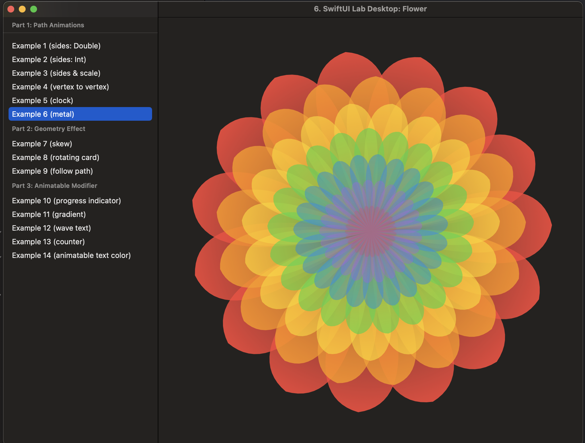

# SwiftUILab Advanced Animations, macOS Port

Legacy macOS-compatible port of SwiftUILab's Advanced Animations sample.

This repo keeps the original SwiftUI animation examples useful on macOS as well
as iOS. It is public because people still ask about the port and use it as a
reference for adapting older SwiftUI examples across Apple platforms.

Original source: [SwiftUI Lab gist](https://gist.github.com/swiftui-lab/e5901123101ffad6d39020cc7a810798).

## What Changed

- Each animation example is split into its own folder.
- The project has a shared SwiftUI code path for iOS and macOS.
- Platform-specific view modifiers are isolated through a small `View`
  extension.

## Screenshot

## Status

This is a historical compatibility port rather than an active product. It is
kept public as a reference for SwiftUI animation experiments and macOS
adaptation.
